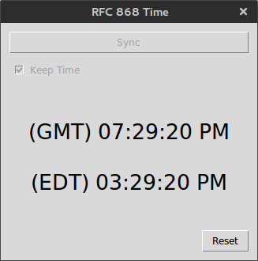

# time_client
Python client utilizing RFC 868 standard and threading to keep track of time

RFC868 Time:

    Desc:   
        Query a time server using RFC 868 standard. 

        Multi-threading capable and thread safe. 
        Each GUI instance communicates with an 
        independent time-keeping thread.

    Depends:    
        Python3.4, pytz

    Author:     
        Mike Gonzalez (mgonz50@rutgers.edu)

Usage:
    ./python time.py

Setup HOW-TO:

    Requirements:
        Python 3 or higher, pytz module

    Steps:
        Extract:
            Extract archive to your working directory.
        Install:
            Install Python and pytz module.
        Run:
            ./python time.py
        Interact:
            'Sync':
                Retrieve time from time server
            'Keep Time':
                Keep track of time after syncing
            'Reset':
                Clear current time and options

